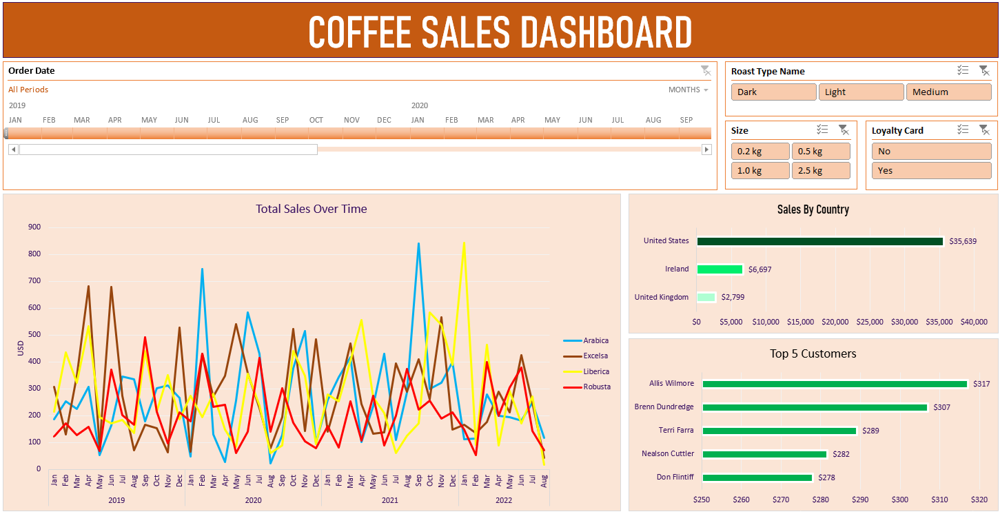

# ☕ Coffee Shop Orders Dashboard

  

An interactive **Excel dashboard** designed to analyze and visualize **coffee shop order data**.  
It provides insights into **sales trends, product performance, and order distribution** across time periods.  
The dashboard helps identify **top-selling beverages**, **peak order times**, and **sales patterns**, supporting data-driven decisions for business growth.

---

## 📊 Overview
This project showcases how Excel can be used to transform raw sales data into meaningful business insights through charts, KPIs, and dynamic visualizations.

---

## 🚀 Features
- Interactive filters and slicers for detailed analysis  
- KPIs summarizing total sales, order volume, and top products  
- Charts for sales by date, product category, and time of day  
- Clean, easy-to-read layout for quick decision-making  

---

## 📁 File Information
**File:** `coffee_shop_orders_dashboard.xlsx`  
**Tool:** Microsoft Excel  
**Type:** Interactive Dashboard  

📂 [Download the Dashboard](coffee_shop_orders_dashboard.xlsx)

---

## 🧩 How to Use
1. Open the Excel file in **Microsoft Excel** or **Excel Online**.  
2. Enable content if prompted.  
3. Use the slicers and charts to explore data insights.

---

## 🧠 Insights
- Identify top-selling drinks and categories  
- Recognize peak business hours  
- Track order patterns and sales growth over time
